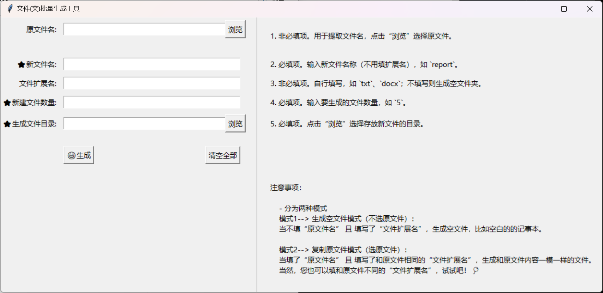

# 文件（夹）批量生成工具 


## 🚀 功能亮点
- **双模式生成**：  
  📌 **模式1**：通过原文件快速复制内容（如批量生成带相同内容的文档）  
  📌 **模式2**：生成空文件或文件夹（如创建空白文本文件或文件夹）

- **自定义控制**  
  🔧 支持自定义新文件名、扩展名、生成数量  
  🔧 可选择输出目录（一键打开生成目录）

- **智能提示**  
  📝 必填项标注（带⭐符号）  
  📝 实时显示文件路径和错误提示

## 📦 依赖库
仅需 Python 标准库，无需额外安装!
（Python 3.7+ 环境已包含所有依赖）

## 📦 运行方式
### 方式1：直接运行 EXE 可执行文件(exe文件在 ./dist/file_batch_generation_tool.exe)
1. 下载 `file_batch_generation_tool.exe`
2. 双击运行即可

### 方式2：运行源码
1. 安装 Python 3.7+ 环境
2. 下载源码文件
3. 执行命令：
```bash
   python file_batch_generation_tool.py
```

## 📝 使用说明
### 1. 界面操作


### 2. 生成模式选择
| 模式          | 操作说明                                                                 |
|---------------|--------------------------------------------------------------------------|
| **模式1（复制）** | 选择原文件 → 输入新文件名 → 填写扩展名（与原文件一致可复制内容）          |
| **模式2（空文件）** | 不选原文件 → 输入新文件名 → 填写扩展名（如 `txt`） → 生成空白文件        |
| **文件夹生成**     | 不选原文件 → 输入新文件名 → 不填扩展名 → 生成空文件夹                   |

### 3. 注意事项
⚠️ **必填项**：新文件名、生成数量、输出目录（带⭐符号）  
	⚠️ **路径检查**：输出目录必须已存在  
	⚠️ **扩展名技巧**：可自定义（如 `pdf`、`py`），或留空生成文件夹


### 文件结构建议
将两个 README 文件放在项目根目录：

```
file_batch_generation_tool/
├── file_batch_generation_tool.py
├── file_batch_generation_tool.exe
├── img/image.png
└── README_zh.md
```

希望这个工具能帮到您！✨